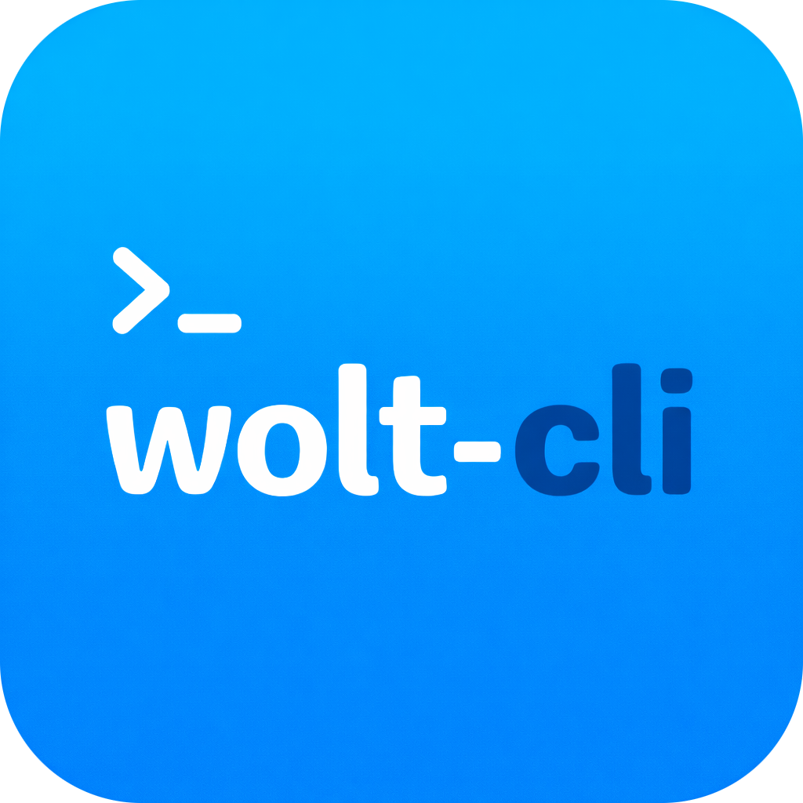

# wolt-cli



`wolt-cli` is an unofficial community Go CLI for interacting with Wolt endpoints from a terminal.
It is not affiliated with Wolt. Use it at your own responsibility.

## What It Covers

- discovery feed and category listing
- venue and item search
- venue details, menus, and hours
- item detail and option matrix inspection
- cart commands (`show`, `count`, `add`, `remove`, `clear`)
- checkout projection (`checkout preview`, no order placement)
- profile/auth commands (`status`, `show`, orders, addresses, payments, favorites)
- token rotation using refresh token (`--wrtoken`)

## Requirements

- Go `1.26+`

## Recommended Install (Homebrew Tap)

Use the dedicated tap at [mekedron/tap](https://github.com/mekedron/tap):

```bash
brew tap mekedron/tap
brew install wolt-cli
```

Or as a one-liner without adding the tap first:

```bash
brew install mekedron/tap/wolt-cli
```

## Build and Run

```bash
go build ./...
go build -o bin/wolt ./cmd/wolt
./bin/wolt --help
```

Or without installing:

```bash
go run ./cmd/wolt --help
```

## First Command to Run

Configure a profile first:

```bash
wolt configure --profile-name default --wtoken "<token>" --wrtoken "<refresh-token>" --overwrite
```

Configure auth in the same profile:

```bash
wolt configure --profile-name default --wtoken "<token>" --wrtoken "<refresh-token>"
```

Cookie auth is also supported:

```bash
wolt configure --profile-name default --cookie "__wtoken=<token>" --cookie "__wrtoken=<refresh-token>"
```

## Config Location

Configuration is loaded from:
- `WOLT_CONFIG_PATH` (if set)
- otherwise `~/.wolt/.wolt-config.json`

Example config: `configs/example.config.json`

## Common Flags

Global flags for all leaf commands:
- `--format [table|json|yaml]`
- `--profile <name>`
- `--address <text>` (temporary location override; geocoded to coordinates)
- `--locale <bcp47>`
- `--no-color`
- `--verbose` (prints upstream HTTP request trace and detailed error diagnostics)
- `--wtoken <token>`
- `--wrtoken <token>`
- `--cookie <name=value>` (repeatable)

Shared location override flags for location-aware commands:
- `--lat <float>`
- `--lon <float>`

Rules:
- `--lat` and `--lon` must be provided together
- `--address` cannot be combined with `--lat/--lon`
- location overrides are preview inputs only; final order placement in Wolt uses the delivery address selected in your Wolt account

## Example: Find Venue, Inspect Options, Add a Custom WHOPPER Meal

`jq` lines are optional convenience helpers for extracting IDs.

```bash
# 0) Validate auth/profile
wolt profile status --verbose
wolt profile show --format json

# 1) Find a venue (copy slug + venue_id from output)
wolt search venues --query "burger king" --limit 10 --format json
wolt search venues --query "burger king" --limit 10 --format json \
  | jq -r '.data.items[] | "\(.slug)\t\(.venue_id)\t\(.name)"'

# 2) Inspect venue products/menu
wolt venue menu burger-king-finnoo --include-options --format json
wolt venue menu burger-king-finnoo --include-options --format json \
  | jq -r '.data.items[] | select(.name|test("whopper"; "i")) | "\(.item_id)\t\(.name)\t\(.base_price.amount)"'
# for partial market assortments, use category-first flow:
wolt venue categories wolt-market-niittari --format json \
  | jq -r '.data.categories[] | "\(.slug)\t\(.name)\tparent=\(.parent_slug // "-")"'
wolt venue search wolt-market-niittari --query "milk" --format json
wolt venue menu wolt-market-niittari --category <category-slug> --include-options --format json

# 3) Inspect a single WHOPPER meal item in detail (item_id from step 2)
wolt item show burger-king-finnoo <item-id> --format json
wolt item options burger-king-finnoo <item-id> --format json
wolt item options burger-king-finnoo <item-id> --format json \
  | jq -r '.data.option_groups[] | .name as $g | .values[] | "\($g)\t\(.name)\t\(.example_option)"'

# 4) Add custom WHOPPER meal with selected options (IDs from step 3)
wolt cart add <venue-id> <item-id> \
  --venue-slug burger-king-finnoo \
  --option "<drink-group-id>=<drink-value-id>" \
  --option "<side-group-id>=<side-value-id>" \
  --option "<addons-group-id>=<addons-value-id>" \
  --count 1 \
  --format json

# Real-world example captured on 2026-02-20 in en-FI locale:
wolt cart add 629f1f18480882d6f02c25f0 676939cb70769df4cec6cc6f \
  --venue-slug burger-king-finnoo \
  --option "69958f7a0ccf540d98667a70=69958f777cb002552fad3d3d" \
  --option "6995b941621e894833915306=6995b93d45f708d8b1ad1345" \
  --option "69958f7a0ccf540d98667a73=69958f777cb002552fad3d51" \
  --format json

# 5) Verify cart details and checkout preview (no order placement)
wolt cart show --details --venue-id <venue-id> --format json
wolt checkout preview --delivery-mode standard --venue-id <venue-id> --format json
# checkout preview uses current inputs only; final checkout in Wolt uses your Wolt-saved address

# Optional cleanup
wolt cart clear --venue-id <venue-id> --format json
```

## Other Common Flows

```bash
wolt profile addresses --format json
wolt profile orders --limit 20 --format json
wolt profile orders show <purchase-id> --format json
wolt profile payments --format json
wolt profile favorites --format json
```

## Test and Lint

```bash
go test ./...
make lint
```

If `golangci-lint` is missing:

```bash
go install github.com/golangci/golangci-lint/v2/cmd/golangci-lint@latest
```

## Security

Profile config may contain `wtoken`, `wrtoken`, and cookies.
Keep config local and do not commit it.
Local config patterns are ignored by `.gitignore` (`.wolt/`, `.wolt-config.json`, `*.wolt-config.json`).

## Copyright

Copyright (c) 2026 Nikita Rabykin.
